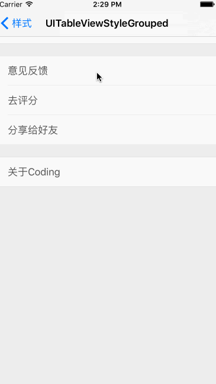

## AhaLineTableViewCell

UITableView 自带的分隔线总是很难满足需求。所以设置成`UITableViewCellSeparatorStyleNone`，然后自定义分隔线。

* UITableViewCell 自定义分隔线。颜色、高度、是否隐藏、offsetX。

* Demo

   
   

#### Podfile

```ruby
platform :ios, '7.0'
pod "AhaLineTableViewCell", "~> 1.0.0"
```